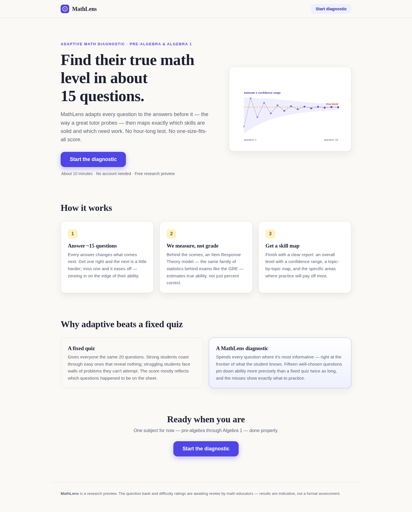
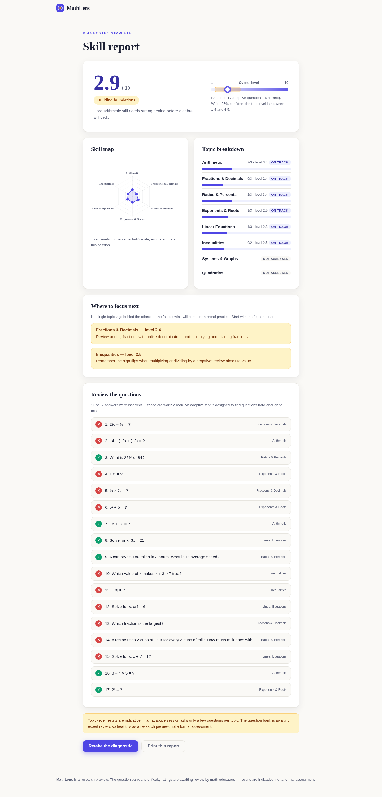

# MathLens — Adaptive Math Diagnostic

MathLens is a short, adaptive math diagnostic for pre-algebra and Algebra 1. Instead of
giving every student the same fixed quiz, it chooses each question based on the answers so
far, measures ability with an Item Response Theory (IRT) model, and finishes with a report
that shows an overall level, a confidence range, and the specific topics worth practicing next.



> **Status: research preview.** The engine is tested and the product works end to end, but
> the question bank and its difficulty ratings were authored by an AI assistant and have
> **not yet been reviewed by math educators**. See [REVIEW.md](REVIEW.md) before using this
> with real students.

## The idea, in plain language

A percent score on a fixed quiz mostly reflects which questions happened to be on the quiz.
Get 70% on an easy quiz and 40% on a hard one and you've learned very little about the
student either time.

IRT reframes the problem. Every question has a **difficulty**, and every student has an
**ability**, both on the same scale. The model (here, the one-parameter logistic or
**Rasch** model) says: the further a student's ability sits above a question's difficulty,
the more likely they are to get it right — exactly 50/50 when the two match.

That reframing buys three things:

1. **A real measurement.** After each answer we ask: *which ability level makes this whole
   pattern of rights and wrongs most probable?* That maximum-likelihood estimate doesn't
   care whether the questions were easy or hard — it accounts for the difficulty of every
   question the student actually saw.

2. **An efficient test.** A question teaches us the most when the student has roughly 50/50
   odds on it — too easy or too hard reveals almost nothing (this is the *item information
   function*; for the Rasch model it peaks exactly where difficulty = ability). So after
   each answer, MathLens re-estimates ability and picks the next question near that
   estimate. Fifteen well-aimed questions pin ability down about as well as a fixed quiz
   several times longer.

3. **Honest uncertainty.** The same math yields a standard error, so the report says
   "level 6.3, and we're 95% confident it's between 5.4 and 7.2" instead of pretending
   to a precision it doesn't have.

For topic-level results (fractions vs. linear equations vs. …), a session only sees a few
questions per topic, so MathLens uses *partial pooling*: each topic estimate is shrunk
toward the student's overall ability, and only topics that clearly pull away get flagged
as strengths or focus areas.



## How a session works

1. `POST /api/sessions` starts a session and returns a first question of middling difficulty.
2. Each answer goes to `POST /api/sessions/{id}/answers`. The engine re-estimates ability
   (a Bayesian MAP estimate while data is thin, maximum likelihood once the pattern is
   mixed), then serves the unused question with the most information at that estimate —
   with light topic balancing so the report covers all areas, and a dash of randomness so
   sessions don't repeat.
3. The session stops after 15–20 questions (early once the standard error is small enough).
4. `GET /api/sessions/{id}/report` returns the full report: ability + confidence interval,
   topic breakdown with verdicts, and a question-by-question review with explanations.
   Correct answers are never sent to the browser during the session.

## Does the measurement actually work?

`python -m scripts.simulate` runs 200 simulated students (whose answers obey the Rasch
model) at each of five true ability levels through the real engine:

```
 true θ  mean θ̂    bias   RMSE  CI cover  avg len
   -2.0    -2.01   -0.01   0.54      94%     17.2
   -1.0    -1.06   -0.06   0.52      95%     16.2
    0.0    -0.03   -0.03   0.56      94%     16.0
    1.0     1.00   +0.00   0.52      94%     16.4
    2.0     2.05   +0.05   0.50      98%     17.8
```

Essentially unbiased across the range, with 95% confidence intervals that cover the truth
at almost exactly the nominal rate, in ~16–18 questions. (This validates the *engine*;
it says nothing about whether the authored difficulty ratings match real students — that
requires pilot data. See REVIEW.md.)

## Project structure

```
app/
  irt.py        Rasch model: probability, information, MLE/MAP estimation, SE
  bank.py       question bank loading (difficulty 1–10 → logit scale)
  adaptive.py   session state, max-information selection, stopping rule
  report.py     ability + topic breakdown + review generation
  main.py       FastAPI app; serves the API and the static frontend
data/
  questions.json  72 items across 8 topics  ⚠ needs human review
frontend/
  index.html / styles.css / app.js   landing → quiz → report (no framework)
scripts/
  validate_bank.py   structural checks on the bank
  simulate.py        ability-recovery simulation study
tests/
  test_irt.py    unit tests for the model math
  test_api.py    end-to-end sessions through the HTTP API
```

The frontend is deliberately dependency-free (vanilla JS + Chart.js, vendored) and is
served by the same FastAPI process, so one process is a complete deployment.

## Accounts & roles

MathLens has optional accounts (email/password and Google sign-in). The diagnostic stays
open to anonymous visitors; logged-in users get each completed diagnostic saved to their
profile (`GET /api/me/results`), which is the foundation for progress-over-time views.

Sessions are server-side rows referenced by an HttpOnly cookie (30 days, revocable),
passwords are argon2id hashes, and password-reset/email-verification links are delivered
via Resend. Every user has a `role` — `student` (default), `teacher`, or `admin` — and a
`teacher_students` link table already exists so teacher↔student features can be added
without a schema rebuild. Emails listed in the `ADMIN_EMAILS` env var become admins.

Configuration (all optional in local dev — SQLite + logged emails are the fallback):

| env var | purpose |
| --- | --- |
| `DATABASE_URL` | Postgres connection string (Neon in production) |
| `SESSION_SECRET` | reserved for future signed tokens |
| `APP_ORIGIN` | canonical origin, used in email links + CSRF check |
| `RESEND_API_KEY` | enables real reset/verification emails |
| `GOOGLE_CLIENT_ID` | enables the Google sign-in button |
| `ADMIN_EMAILS` | comma-separated admin allow-list |

## Run it locally

```bash
pip install -r requirements.txt
uvicorn app.main:app --reload
# open http://localhost:8000
```

Tests and checks:

```bash
pip install pytest httpx
python -m pytest              # 21 tests: model math + full API sessions
python -m scripts.validate_bank
python -m scripts.simulate
```

## Deploy

The repo includes `render.yaml`, so it deploys to [Render](https://render.com) as a free
web service in a few clicks:

[](https://render.com/deploy?repo=https://github.com/davidsalles2010-hub/IRT-tutor)

Or manually: **New → Web Service**, point it at this repo, accept the defaults. The free
tier sleeps when idle — expect a ~50 s cold start on the first visit.

Anything that runs a Python process works the same way:
`uvicorn app.main:app --host 0.0.0.0 --port $PORT`.

## Honest limitations (v0.1)

The question bank needs expert review — content, answers, and difficulty ratings — and the
authored 1–10 difficulties should eventually be replaced with values calibrated from real
response data. The Rasch model doesn't account for guessing on multiple-choice items (a
student can get ~25% right by chance; a 3PL model or a guessing correction is future work).
Sessions live in process memory, which is fine for a single free-tier instance but needs
Redis/a database before scaling past one process. All TODOs are marked in code and
collected in [REVIEW.md](REVIEW.md).

## License

MIT — see [LICENSE](LICENSE).
